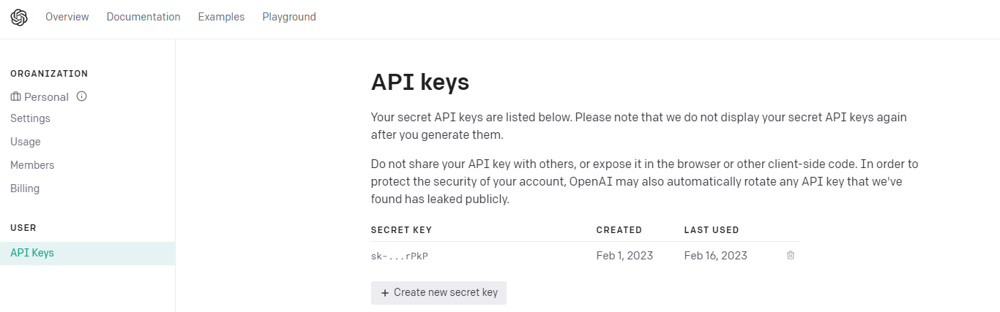
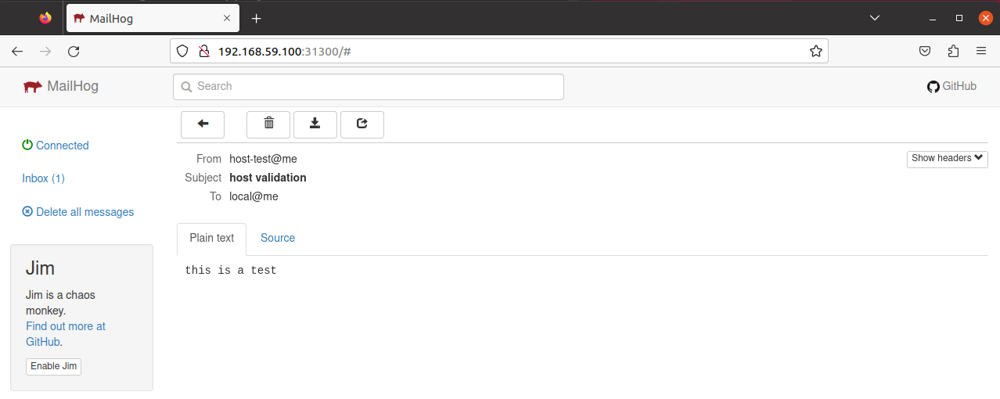
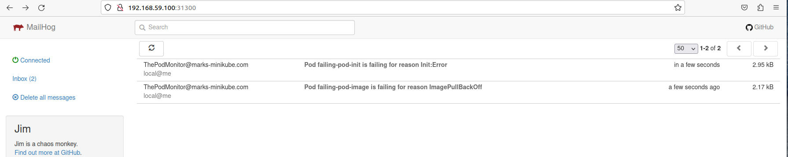
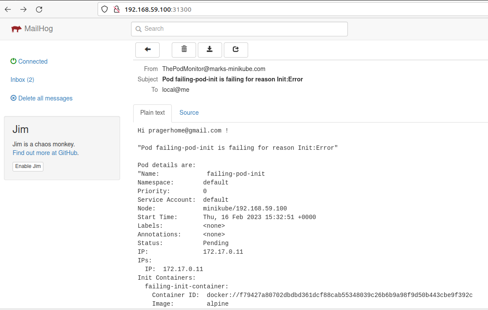

# Contents {#contents .TOC-Heading}

[Abstract [2](#abstract)](#abstract)

[Caveats [2](#caveats)](#caveats)

[Step 1 - Get your own ChatGPT API key from openai.com
[3](#step-1---get-your-own-chatgpt-api-key-from-openai.com)](#step-1---get-your-own-chatgpt-api-key-from-openai.com)

[Step 2 -- Write your python code to query ChatGPT
[4](#step-2-write-your-python-code-to-query-chatgpt)](#step-2-write-your-python-code-to-query-chatgpt)

[Step 3 -- Check your API key and script
[5](#step-3-check-your-api-key-and-script)](#step-3-check-your-api-key-and-script)

[Step 4 -- Dockerize this script into a working image.
[6](#_Toc127795624)](#_Toc127795624)

[Step 5 -- Deploy this image into my minikube cluster
[7](#step-5-deploy-this-image-into-my-minikube-cluster)](#step-5-deploy-this-image-into-my-minikube-cluster)

[Step 6 -- Accessing the pod via a load-balancer service.
[9](#step-6-accessing-the-pod-via-a-load-balancer-service.)](#step-6-accessing-the-pod-via-a-load-balancer-service.)

[Step 7 -- Set up Mailhog -- in order to grab the emails
[10](#section)](#section)

[Step 8 -- Create the Docker image to monitor the Kubernetes pods
[11](#step-8-create-the-docker-image-to-monitor-the-kubernetes-pods)](#step-8-create-the-docker-image-to-monitor-the-kubernetes-pods)

[Step 9 -- Deploy the monitoring pod
[13](#step-9-deploy-the-monitoring-pod)](#step-9-deploy-the-monitoring-pod)

[Step 10 -- Review your cluster
[15](#step-10-review-your-cluster)](#step-10-review-your-cluster)

[Step 11 -- Lets add some failing Pods.
[16](#step-11-lets-add-some-failing-pods.)](#step-11-lets-add-some-failing-pods.)

[Step 12 -- Check your email (in mailhog )
[17](#step-12-check-your-email-in-mailhog)](#step-12-check-your-email-in-mailhog)

[Conclusion [18](#_Toc127795633)](#_Toc127795633)

[Improvements [18](#improvements)](#improvements)

# Abstract

As a frequent user of Kubernetes, as many will know -- there are times
where pods fail for various reasons. Monitoring usually requires set up
of metrics servers, and perhaps some sort of dashboarding tool (like
Grafana) to keep an eye on things. This obviously requires Eyes-On-Glass
or some sort of other service like PagerDuty to alert you to the fact
that things are beginning to go haywire.

I had the thought, that perhaps one could write a monitoring script that
would be run as a pod, and upon noticing a failure -- would grab all the
information, and query ChatGPT for the error, and perhaps give some
insight into how to solve the issue.

The whole system, that I put together is far from perfect, and is stuff
that I sellotaped together on my home PC running 'minikube' -- yet as a
PoC -- it does prove a point.

# Caveats

My original idea was to have the pod send an email to my personal Gmail
account. However, that proved harder than it seemed as first --
especially as I was running minikube, and Gmail requires some
authentication and known email servers, certificates and the like -- and
that defeated the purpose of the PoC.

Therefore, I used a deployment of 'mailhog' on the minikube cluster to
catch the mail. Obviously in a real production system -- this would need
to be sorted out.

Also, the python script uses "flask" to run a web client, this again is
noted as not production worthy.

# Step 1 - Get your own ChatGPT API key from openai.com 

I simply opened a personal account on OpenAI, and from there created my
own API key --

{width="6.5in" height="2.0319444444444446in"}

# Step 2 -- Write your python code to query ChatGPT

This is a simple task, and I put this together based on hunting around
the internet on how to do this. I also used the 'flask' module -- to
help create a listener for the python app:

Code available
[here](https://github.com/maprager/chatgpt-k8s-monitoring/blob/main/chatgpt.py):\


import openai

from flask import Flask, jsonify, request, Response

\# Add your OpenAI API key

openai.api_key = \"PUT-YOUR-OPENAI-API-KEY-HERE\"

def generate_text(prompt):

completions = openai.Completion.create(

engine=\"text-davinci-002\",

prompt=prompt,

max_tokens=1024,

n=1,

stop=None,

temperature=0.7,

)

message = completions.choices\[0\].text

return message.strip()

app = Flask(\_\_name\_\_)

\@app.route('string:query\>')

def chat(query):

return (generate_text(query))

\# main function

if \_\_name\_\_ == '\_\_main\_\_':

app.run(host=\"0.0.0.0\", port=5000, debug = True)

# Step 3 -- Check your API key and script

Run your script:\
root@ubuntu2004:\~/chatgpt# python3 chatgpt.py

\* Serving Flask app 'chatgpt'

\* Debug mode: on

**WARNING: This is a development server. Do not use it in a production
deployment. Use a production WSGI server instead.**

\* Running on all addresses (0.0.0.0)

\* Running on http://127.0.0.1:5000

\* Running on http://10.0.2.15:5000

Press CTRL+C to quit

\* Restarting with stat

\* Debugger is active!

\* Debugger PIN: 398-359-098

The request to the ChatGPT will need to be url encoded, for that I wrote
another bash script ( found
[here](https://github.com/maprager/chatgpt-k8s-monitoring/blob/main/queryChat.sh)
):

#!/bin/bash\
url=\"127.0.0.1:5000\"\
args=\"\$\*\"\
encoded_string=\$(printf \"%s\" \"\$args\" \| sed -e \'s/%/%25/g\' -e
\'s/ /%20/g\' -e \'s/!/%21/g\' -e \'s/\"/%22/g\' -e \'s/#/%23/g\' -e
\'s/\\&/%26/g\' -e \"s/\'/%27/g\" -e \'s/(/%28/g\' -e \'s/)/%29/g\' -e
\'s/\\\*/%2a/g\')\
curl \"{\$url}/\${encoded_string}\"

When now using this script -- we get the output:\


./queryChat.sh \"What Is ChatGPT\"

?

ChatGPT is a new type of chatbot that uses the power of artificial
intelligence (AI) to help you chat with people online. The bot is
designed to understand natural language and respond accordingly.

How Does ChatGPT Work?

ChatGPT uses a variety of techniques to understand the user's input.
These include natural language processing, machine learning, and
rule-based systems. The bot then responds accordingly, providing the
user with relevant information or engaging in conversation.

What Can ChatGPT Do?

ChatGPT can be used for a variety of tasks, including customer service,
online dating, and online gaming. The bot is also capable of learning
new tasks over time, making it a versatile tool for a variety of
applications.

Great we now know that this is working.

[]{#_Toc127795624 .anchor}

# Step 4 -- Dockerize this script into a working image. 

I achieved this with the following Dockerfile: (available
[here](https://github.com/maprager/chatgpt-k8s-monitoring/blob/main/Dockerfile.chatgpt-client-image):)

FROM alpine:latest

\# Install python/pip and other requirements

ENV PYTHONUNBUFFERED=1

RUN apk add \--update \--no-cache python3 && ln -sf python3
/usr/bin/python

RUN python3 -m ensurepip

RUN pip3 install \--no-cache \--upgrade pip setuptools

RUN pip3 install openai requests flask

\# Copy the script file into the container

COPY chatgpt.py .

\# Make the script executable

RUN chmod +x ./chatgpt.py

CMD \[\"python3\",\"./chatgpt.py\"\]

And building the image, tagging and pushing to a repo

docker build -t chatgpt-local:1.0 .\
docker tag chatgpt-local:1.0 pragerhome/chatgpt-local:1.0\
docker push pragerhome/chatgpt-local:1.0

***Note: I used dockerhub as my repository holder -- since this is what
the minikube was set up to do by default. You can see the repo here:
<https://hub.docker.com/repository/docker/pragerhome/chatgpt-local/general>***

# Step 5 -- Deploy this image into my minikube cluster

apiVersion: apps/v1

kind: Deployment

metadata:

name: chatgpt-client

namespace: default

labels:

functionGroup: chatgpt-client

service: chatgpt-client

deployedby: mark

version: \"1.0\"

spec:

selector:

matchLabels:

functionGroup: chatgpt-client

service: chatgpt-client

version: \"1.0\"

deploymentTag: \"1.0\"

strategy:

type: RollingUpdate

rollingUpdate:

maxUnavailable: 0

maxSurge: 1

template:

metadata:

annotations:

tags: chatgpt-client

labels:

functionGroup: chatgpt-client

service: chatgpt-client

version: \"1.0\"

deploymentTag: \"1.0\"

spec:

containers:

\- name: chatgpt-client

image: pragerhome/chatgpt-local:1.0

imagePullPolicy: IfNotPresent

env:

\- name: POD_NAME

valueFrom:

fieldRef:

fieldPath: metadata.name

\- name: NODE_ENV

value: production

ports:

\- name: server-port

containerPort: 5000

protocol: TCP

resources:

requests:

memory: \"512Mi\"

cpu: \"100m\"

limits:

memory: \"512Mi\"

cpu: \"200m\"

I wrote the following deployment.yaml (available
[here](https://github.com/maprager/chatgpt-k8s-monitoring/blob/main/deploy-chatgpt-client-local.yaml))
to deploy the previous image into my cluster

Following a quick kubectl apply -- we can see that it is running nicely
in the cluster:

root@ubuntu2004:\~/chatgpt# kubectl get pod

NAME READY STATUS RESTARTS AGE

chatgpt-client-546d8d98-vcdpc 1/1 Running 4 (4h24m ago) 9d

and we can check the logs of the pod:

root@ubuntu2004:\~/chatgpt# kubectl logs -f
chatgpt-client-546d8d98-vcdpc

\* Serving Flask app 'chatgpt'

\* Debug mode: on

**WARNING: This is a development server. Do not use it in a production
deployment. Use a production WSGI server instead.**

\* Running on all addresses (0.0.0.0)

\* Running on http://127.0.0.1:5000

\* Running on http://172.17.0.5:5000

Press CTRL+C to quit

\* Restarting with stat

\* Debugger is active!

\* Debugger PIN: 820-136-958

# Step 6 -- Accessing the pod via a load-balancer service.

To access the pod, I wanted it to be available externally. Obviously,
this is up for discussion, and could be accessible via an ingress or
some other service. I was looking for something quick and dirty -- so I
brought up the following Kubernetes service using the following yaml
(available
[here](https://github.com/maprager/chatgpt-k8s-monitoring/blob/main/service-lb.yaml)):\


apiVersion: v1

kind: Service

metadata:

name: chatgpt-client-lb

namespace: default

labels:

functionGroup: chatgpt-client

service: chatgpt-client

deployedby: markp

version: \"1.0\"

wait: \"false\"

spec:

selector:

functionGroup: chatgpt-client

service: chatgpt-client

version: \"1.0\"

deploymentTag: \"1.0\"

ports:

\- protocol: TCP

port: 80

targetPort: server-port

type: LoadBalancer

***Note: This was not a simple task to get running on minikube, and I
followed instructions listed here:\
<https://faun.pub/metallb-configuration-in-minikube-to-enable-kubernetes-service-of-type-loadbalancer-9559739787df>***

Following this deployment, I could see the load balancer up and running
in K8s:



root@ubuntu2004:\~/queryPodError# kubectl get service

NAME TYPE CLUSTER-IP EXTERNAL-IP PORT(S) AGE

chatgpt-client-lb LoadBalancer 10.108.79.182 192.168.59.105 80:31159/TCP
9d

Changing the URL of the queryChat script given in Step2 to the external
IP address -- we can now use the pod to query chatGPT:



url=\"192.168.59.105:80\"



./queryChat.sh \"What is a load-balancer?\"

A load balancer is a device that distributes network traffic across a
number of servers. This ensures that no single server is overloaded with
requests, improving overall performance.

# 

# Step 7 -- Set up Mailhog -- in order to grab the emails

I found this interesting article on the internet, that helped me set up
mailhog on the Kubernetes cluster:\
<https://fabianlee.org/2022/01/16/kubernetes-running-a-mail-container-for-testing-email-during-development/>

This gives a step-by-step instruction how to do this using helm charts,
and was really quite easy to follow.

Using the 'swaks' (<http://www.jetmore.org/john/code/swaks> )

I was able to test out the mailhog, to indeed see I could receive
'dummy' emails:\


swaks -f host-test@me -t local@me -s \$node_ip -p \$smtp_port \--body
\"this is a test\" \--header \"Subject: host validation\"

{width="6.5in" height="2.59375in"}

# Step 8 -- Create the Docker image to monitor the Kubernetes pods

Using a combination of the code written before to send the email and to
query ChatGPT -- I created a script to monitor the pods, the source code
is available
[here](https://github.com/maprager/chatgpt-k8s-monitoring/blob/main/queryPodError.sh):



#!/bin/bash

chaturl=\$(kubectl get svc \| grep chatgpt-client-lb \| awk '{print
\$4}')

node_ip=\$(kubectl get nodes
-o=jsonpath='{.items\[0\].status.addresses\[0\].address}')

smtp_port=\$(kubectl \--namespace email get svc mailhog
-o=jsonpath=\"{.spec.ports\[?(@.name=='tcp-smtp')\].nodePort}\")

while true

do

listOfBadPods=\$(kubectl get pod \| grep -v NAME \| grep -v Running \|
grep -v Completed \| awk '{print \$1}')

for i in \$listOfBadPods

do

podname=\$(echo \$i) ;

error=\$(kubectl get pod \$i \| grep -v STATUS \| awk '{print \$3}')

describe_pod=\$(kubectl describe pod \$i)

args=\$(echo \"One of my kubernetes pods reports \$error .What does this
mean ?\")

encoded_string=\$(printf \"%s\" \"\$args\" \| sed -e 's/%/%25/g' -e 's/
/%20/g' -e 's/!/%21/g' -e 's/\"/%22/g' -e 's/#/%23/g' -e 's/\\&/%26/g'
-e \"s

/'/%27/g\" -e 's/(/%28/g' -e 's/)/%29/g' -e 's/\\\*/%2a/g')

chat_response=\$(curl -s \"{\$chaturl}/\${encoded_string}\")

mailto=pragerhome@gmail.com

mail_subject=\$(echo \"Pod \$i is failing for reason \$error\")

cat \<\< EOF \> /tmp/mail-details.txt

Hi \$mailto !

\"\$mail_subject\"

Pod details are:

\"\$describe_pod\"

ChatGPT says on this:

\$chat_response

Regards

The Pod Monitor

EOF

subject=\"\$mail_subject\"

/usr/bin/perl swaks -f \"ThePodMonitor@marks-minikube.com\" -t local@me
-s \$node_ip -p \$smtp_port \--header \"Subject: \$subject\" \--body
/tmp/mail-d

etails.txt

done

sleep 60

done

***Note: This image runs a while loop that sleeps every 60 seconds,
therefore you will get repeated emails of failing pods.***

Based on this image, using the following Docker file, create an image to
run this script (Source available
[here](https://github.com/maprager/chatgpt-k8s-monitoring/blob/main/Dockerfile.for_pod_monitoring))



\# Use a minimal base image

FROM alpine

\# Add curl and perl

RUN apk add \--update perl perl-net-dns curl bash

ADD http://www.jetmore.org/john/code/swaks/files/swaks-20170101.0/swaks
swaks

\# Add kubectl

RUN curl -LO
https://storage.googleapis.com/kubernetes-release/release/\$(curl -s
https://storage.googleapis.com/kubernetes-release/release/stable.txt)/bin/linux/amd64/kubectl

RUN chmod +x ./kubectl

RUN mv ./kubectl /usr/local/bin

\# Copy the bash script into the image

COPY ./queryPodError.sh /usr/local/bin/

\# Make the script executable

RUN chmod +x /usr/local/bin/queryPodError.sh

\# Set the command that will run the script

CMD \[\"/bin/bash\",\"/usr/local/bin/queryPodError.sh\"\]

Following this, obviously one needs to build, tag, and push as before to
the docker registry

docker build -t query-pod-error:1.2 .

docker tag query-pod-error:1.2 pragerhome/query-pod-error:1.2

docker push pragerhome/query-pod-error:1.2

# Step 9 -- Deploy the monitoring pod

In order to deploy, I used the following deployment yaml (source code
available
[here](https://github.com/maprager/chatgpt-k8s-monitoring/blob/main/deploy-query-pod-error.yaml)
):

apiVersion: apps/v1

kind: Deployment

metadata:

name: query-pod-error-pod

namespace: default

labels:

functionGroup: query-pod-error-pod

service: query-pod-error-pod

deployedby: mark

version: \"1.0\"

spec:

selector:

matchLabels:

functionGroup: query-pod-error-pod

service: query-pod-error-pod

version: \"1.0\"

deploymentTag: \"1.0\"

strategy:

type: RollingUpdate

rollingUpdate:

maxUnavailable: 0

maxSurge: 1

template:

metadata:

annotations:

tags: query-pod-error-pod

labels:

functionGroup: query-pod-error-pod

service: query-pod-error-pod

version: \"1.0\"

deploymentTag: \"1.0\"

spec:

containers:

\- name: query-pod-error-pod

image: pragerhome/query-pod-error:1.2

imagePullPolicy: IfNotPresent

env:

\- name: POD_NAME

valueFrom:

fieldRef:

fieldPath: metadata.name

\- name: NODE_ENV

value: production

resources:

requests:

memory: \"512Mi\"

cpu: \"100m\"

limits:

memory: \"512Mi\"

cpu: \"200m\"

***Note: For the script to run kubectl within a Kubernetes pod, I needed
to create a cluster role and cluster role binding.***

***The cluster role was created as follows (source code
[here](https://github.com/maprager/chatgpt-k8s-monitoring/blob/main/cluster-role.yaml))***

kind: ClusterRole

apiVersion: rbac.authorization.k8s.io/v1

metadata:

namespace: default

name: service-reader

rules:

\- apiGroups: \[\"\"\] \# \"\" indicates the core API group

resources: \[\"pods\",\"services\",\"nodes\"\]

verbs: \[\"get\", \"watch\", \"list\"\]

***Run this and the cluster role binding:***

kubectl apply -f cluster-role.yaml

kubectl create clusterrolebinding service-reader-pod
\--clusterrole=service-reader \--serviceaccount=default:default

# Step 10 -- Review your cluster

At this stage, the chatGPT client, the monitoring pod, and the mail
client, should all be running smoothly in your cluster.

This is part of the capture from my minikube:



NAMESPACE NAME READY STATUS RESTARTS AGE

default chatgpt-client-546d8d98-vcdpc 1/1 Running 4 (7h45m ago) 9d

default query-pod-error-pod-84c68dfc44-vp6w5 1/1 Running 0 109s

email mailhog-659c47b49-nq7bq 1/1 Running 0 7h28m

metallb-system controller-55496b5cd7-9qrnb 1/1 Running 4 (7h45m ago) 9d

metallb-system speaker-fx56w 1/1 Running 4 (7h45m ago) 9d

# Step 11 -- Lets add some failing Pods.

We add to the cluster pods that are going to fail -- one with an init
fail, and one with an imagePullBackoff. The source code for these pods
are available
[here](https://github.com/maprager/chatgpt-k8s-monitoring/blob/main/deploy-pod-init-fail.yaml):



apiVersion: v1

kind: Pod

metadata:

name: failing-pod-init

spec:

initContainers:

\- name: failing-init-container

image: alpine

command: \[\"/bin/sh\", \"-c\", \"exit 1\"\]

containers:

\- name: failing-container

image: alpine

And
[here](https://github.com/maprager/chatgpt-k8s-monitoring/blob/main/deploy-pod-image-fail.yaml):



apiVersion: v1

kind: Pod

metadata:

name: failing-pod-image

spec:

containers:

\- name: failing-image

image: gobledegook

Now, one can see the failing pods also --



root@ubuntu2004:\~/chatgpt# kubectl get pods

NAME READY STATUS RESTARTS AGE

chatgpt-client-546d8d98-vcdpc 1/1 Running 4 (7h51m ago) 9d

failing-pod-image 0/1 ErrImagePull 0 10s

failing-pod-init 0/1 Init:CrashLoopBackOff 3 (44s ago) 98s

query-pod-error-pod-84c68dfc44-vp6w5 1/1 Running 0 8m17s

# Step 12 -- Check your email (in mailhog )

If one goes into the mailhog webui -- we will see two emails referring
to these failing pods:

{width="6.5in" height="1.3034722222222221in"}

**A closer look at one of the emails reveals:**

{width="6.5in" height="4.136805555555555in"}

Towards the end of the mail -- you will find, a small note from ChatGPT
-- which can help sort out your issues:\
\
***ChatGPT says on this:\
This means that the pod was unable to initialize correctly. This could
be due to a number of reasons, such as an incorrect container image,
incorrect command line arguments, or an error in the container
itself.***

[]{#_Toc127795633 .anchor}Conclusion

We have managed to prove, that even on a small cluster like minikube, we
can run a monitoring script that will also query ChatGPT for solutions.

Note also that repeated calls to ChatGPT gives sometimes different
answers to the problem.

#  Improvements

There are several ways to improve on this, and this exercise was purely
a PoC. We could run the monitor script as a kubectl cron job without the
while loop for example.

As they say there are many ways to skin a cat -- and this was just one
way of implementing the solution.

[Mark Prager, Feb 2023]{.smallcaps}
